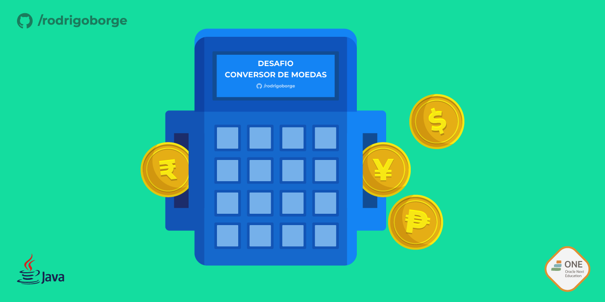
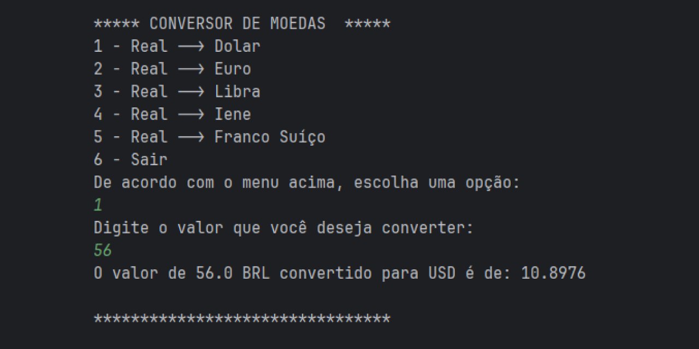

# Conversor de Moedas em Java

<div align="center">

[](https://opensource.org/licenses/MIT)
[](https://www.java.com/)


</div><br>

<br><br><br>

# Conversor de Moedas

Este é um programa em Java que permite converter valores de Real brasileiro (BRL) para outras moedas, como Dólar americano (USD), Euro (EUR), Libra esterlina (GBP), Iene japonês (JPY) e Franco suíço (CHF). O programa usa a API de taxas de câmbio para obter as taxas de conversão em tempo real.



## Funcionalidades

- Escolha a moeda de destino para conversão: USD, EUR, GBP, JPY ou CHF.
- Insira o valor em Real que deseja converter.
- Veja o valor convertido na moeda de destino.

## Badge
Este é um badge conquistado por ter desenvolvido este projeto com a Alura no programa ONE - "Oracle Next Education" em parceria com a Oracle:

<div align="center">


</div>

## Como usar

1. Clone este repositório em sua máquina local:
```
git clone https://github.com/rodrigoborge/conversor-moedas-java.git
```
2. Navegue até o diretório do projeto:
```
cd conversor-moedas-java
```
3. Compile o código fonte:
```
javac ConversorMoedas.java
```
4. Execute o programa:
```
java ConversorMoedas
```

5. Siga as instruções exibidas no console para realizar as conversões desejadas.

## Autor

Este Conversor de Moedas em Java foi desenvolvido por [Rodrigo Borge](https://github.com/rodrigoborge).


## Contribuição

Contribuições são bem-vindas! Sinta-se à vontade para enviar sugestões, correções de bugs ou melhorias através de issues e pull requests.

## Licença

Este projeto está licenciado sob a [Licença MIT](LICENSE).


